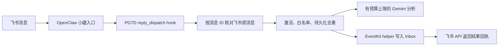

# 在已有 OpenClaw 中安装 PGTD

任务 06 已提供插件入口 `openclaw/index.js`、根目录 `openclaw.plugin.json`、配置模板和恢复入口。安装方无需重写收集业务，也无需新建 agent。**2026-09-27 已链接安装并启用到本机网关，真实飞书闭环尚未验收。**详见 [本机安装记录](installation-2026-09-27.md)。

交给管理 OpenClaw 的 agent 时，请先读 [安装与调试交接](openclaw-handoff.md)。当前本机已具备 Node 24.21.0、OpenClaw 2026.9.6、飞书插件 2026.9.6，以及已验证的 Apple helper 和默认账户 Inbox 绑定。

## 运行路径



- 指令在普通 agent 推理前处理。由代码使用飞书账户、入口 agent、发送者、会话白名单授权；模型不能填写来源身份或自行决定写入权限。
- 从飞书 API 核对消息 ID、`open_id`、`chat_id`、原始类型、创建时间、原文和父消息。图片、音频、富文本 post、卡片等不转成可写入文本；已编辑或删除消息拒收。
- 不读取文章 URL。文章链接只收集到 Inbox，之后由用户手动整理到 `Wiki`。
- 通过真实回执消息 ID 关联后续回复，重启后仍能补充原事项的时间。也支持回复原始用户指令。
- 持久化回执发送意图；已确认发送不重复发送。响应未知时停止自动重发，不能保证所有故障下都有可见回执。
- 不给模型开放任意 shell、Apple 删除/完成/移动工具；现有 `gtd` agent 仅复用 Google 凭据。运行模型仍是 05 的 `gemini-flash-latest` 适配，其他提供商需要另加适配，不能只改模型名。

## 本地验证

```bash
npm ci --ignore-scripts
npm run check
npm test
npm run demo:feishu
npm run plugin:validate
npm run openclaw:check -- --agent gtd
```

`demo:feishu` 使用模拟飞书、模型和 Apple；30 条合成事件外加一次重投，预期 20 条事项、30 条回执。输出本地模拟延迟，不代表真实链路性能。

`plugin:validate` 使用临时 OpenClaw 配置运行 `plugins doctor` 和 `plugins inspect --runtime`，确认实际加载和 hook 注册；不安装进现有网关，不访问真实业务服务。2026.9.6 的 `plugins validate` 子命令专用于工具/feature authoring 元数据，不能直接验证本项目的 hook/service 插件。

## 安装组成

1. 本仓库代码、Node 依赖、在目标 Mac 编译的 EventKit helper。
2. 私有配置：Apple source/list ID、飞书白名单、共享模型预算账本、持久化状态目录。
3. OpenClaw 安装/启用 `personal-gtd` 插件；保留现有小婕、gtd、wiki 角色和其他配置。
4. 从网关实际运行身份验证 Apple 权限、飞书查询/回复权限、Google 凭据和费用限制。

开发技能 `.agents/skills` 不参与运行安装。具体安装、回滚和逐项真实验收见 [管理 agent 交接](openclaw-handoff.md)。

## 接口依据和限制

核对了本机 2026.9.6 的 hook 类型、`reply_dispatch` 调用位置、飞书 `buildContext` 字段及官方 Node SDK 1.73.3 的消息接口。只支持该版本验证过的接口组合；升级后重做加载和真实接入验收。

官方资料：[OpenClaw message hooks](https://docs.openclaw.ai/plugins/hooks/messages)、[插件构建](https://docs.openclaw.ai/plugins/building-plugins)、[飞书获取消息](https://open.feishu.cn/document/server-docs/im-v1/message/get)、[飞书回复消息](https://open.feishu.cn/document/server-docs/im-v1/message/reply)。飞书网页正文使用客户端渲染，本轮具体字段同时依据本机官方 SDK 类型核对。
