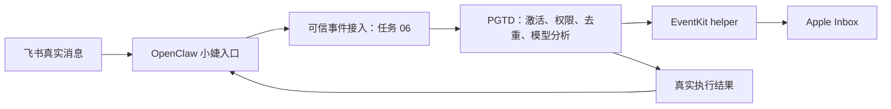

# 已有 OpenClaw agent，如何安装 PGTD

## 当前可以使用的部分

03 的恢复引擎、04 的 Apple 接入、05 的 Gemini 分析都已实现。现有 `gtd` agent 可以保留；本项目会复用它的 Google 凭据。本机 Apple helper 已编译、授权并绑定默认账户 Inbox，无须重新创建 agent。

在项目目录检查：

```bash
npm run openclaw:check -- --agent gtd
```

当前会显示 Apple 已准备好、`entryInstalled: false`。这是准确状态：**尚未把飞书消息自动接入这条业务链**。现有 agent 的聊天模型配置不等于 PGTD 已安装。

现在可从终端运行整条本机路径：

```bash
npm run start:model -- --config runtime/model/apple-config.json --state-dir runtime/apple --apple
```

它接收规范化 JSONL，调用真实模型、写入真实 Apple，返回状态和对象 ID；受已批准的共享测试预算限制。详细输入见 README。它不是飞书机器人启动命令。

## 整体安装包含什么

1. **业务程序**：本仓库 Node 代码、依赖、macOS EventKit helper。新的 Mac 需要 `npm ci --ignore-scripts`、`npm run build:apple` 和 Apple 系统授权。
2. **私有配置与操作日志**：账户/列表 ID、允许的用户和会话、模型预算、恢复目录。放在运行目录，不能复制另一台机器的 Apple ID 或私人日志当作通用配置。
3. **OpenClaw 接入插件（任务 06）**：把可信飞书事件交给业务入口，并把真实结果回传；注册受限业务能力，按 agent 范围启用。
4. **agent 使用说明与权限**：沿用 `gtd` 角色，提供工具使用规则；由“小婕”接收消息。无需给 agent 开放任意 shell 或全部 Apple 操作。

开发用 `.agents/skills` 是帮助写代码的规范，不能直接当成运行安装包。仅复制 SKILL.md 或向 agent 说“你能写 Apple”不会获得业务工具、去重或系统权限。

## 任务 06 需要完成的接线



接入必须从 OpenClaw/飞书可信上下文取得消息 ID、发送者、会话、原文、时间和回复关联，不能由模型自行填写这些权限字段。子 agent 转交也须保留来源关联。发送失败后如何核对回执，也要根据飞书真实能力处理，不能套用模拟服务的幂等保证。

当前安装的 OpenClaw 2026.9.6 支持插件工具和入站/回复 hooks，但需要验证现有飞书插件提供的实际事件字段。接入插件尚未生成，因此目前不存在一个可宣称“安装后马上能从飞书收集”的 PGTD 安装命令。任务 06 完成时再交付插件包、安装命令、按 `gtd` 启用的配置和飞书端验收；不替换现有 agent，不覆盖其他 agent 的权限或凭据。

参考：[OpenClaw 插件构建](https://docs.openclaw.ai/plugins/building-plugins)、[插件工具](https://docs.openclaw.ai/plugins/tool-plugins)、[插件 hooks](https://docs.openclaw.ai/plugins/hooks)。本轮同时核对了本机安装版本的 SDK 类型；未擅自更改运行网关或发送飞书消息。
